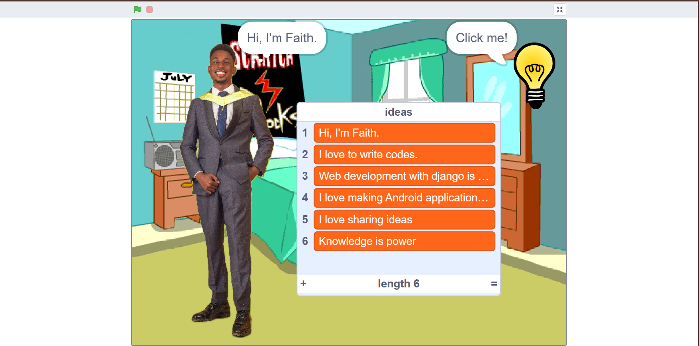

# My Scratch Project

This is a Scratch project I made!

🎮 **How to Play:**  
Click the green flag and then click the lightbulb to see few details about me.

📁 **Download the `.sb3` file** and open it in [Scratch](https://scratch.mit.edu/) to run.

---

